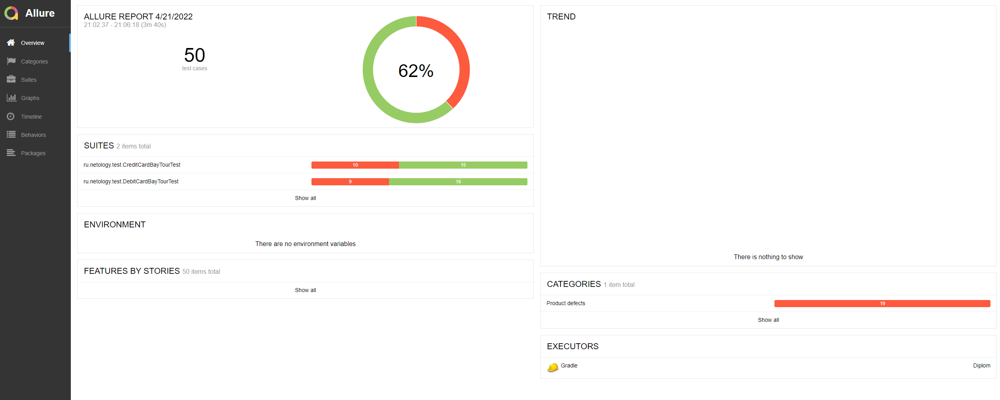

# Отчет о тестировании

### Краткое описание:

- Была выполнена автоматизация тестирования покупки тура в Марракеш.
- Проверена поддержка заявленных СУБД: MySQL и PostgreSQL. Приложение успешно функционирует с каждой из заявленных.

### Количество тест-кейсов:
Было автоматизировано 64 тест-кейса:

- для покупки тура по дебетовой карте - 25 тест-кейса;
- для покупки тура в кредит - 25 тест-кейса.

### Количество успешных и неуспешных тест-кейсов:

- Количество успешных тест - кейсов: 31 (62%);
- Количество неуспешных тест - кейсов: 19(38%).

#### Allure Report:

### Общие рекомендации:

Текущая версия приложения не рекомендуется к релизу по причине выявленных дефектов.
Рекомендуется устранить выявленные ошибки, которые описаны в [Issue](https://github.com/Azize87/Diplom/issues).